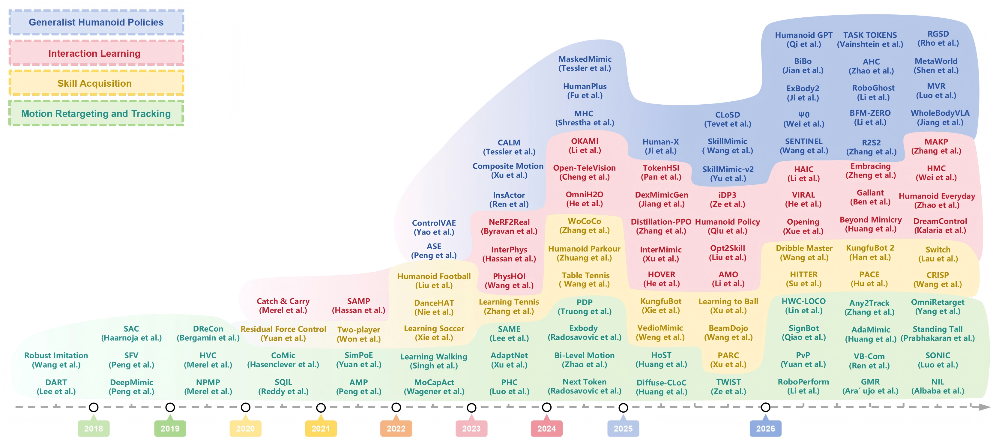

# Awesome Humanoid Imitation Learning Survey

[](https://awesome.re) [](http://makeapullrequest.com)



This repository collects papers from **A Survey of Humanoid Imitation Learning** and organizes them according to the survey's **Methods of Humanoid Imitation Learning** taxonomy.

Supporting metadata is kept in `data/papers.json`, but the README classification follows only the method categories and subcategories used in the paper.

## Contents

- [Awesome Humanoid Imitation Learning](#awesome-humanoid-imitation-learning)
  - [Motion Retargeting and Tracking](#motion-retargeting-and-tracking)
  - [Skill Acquisition](#skill-acquisition)
  - [Interaction Learning](#interaction-learning)
  - [Generalist Humanoid Policies](#generalist-humanoid-policies)
- [Data Format](#data-format)

---

## Awesome Humanoid Imitation Learning

### Motion Retargeting and Tracking

Human-to-Humanoid motion retargeting, and physics-based reference tracking.

#### Motion Retargeting

- [T-RO 2017](https://doi.org/10.1109/TRO.2017.2752711), **Ayusawa et al.**: Motion Retargeting for Humanoid Robots Based on Simultaneous Morphing Parameter Identification and Motion Optimization
- [Humanoids 2019](https://doi.org/10.1109/Humanoids43949.2019.9035059), **Whole-Body Geometric Retargeting**: Whole-Body Geometric Retargeting for Humanoid Robots
- [ICRA 2021](https://arxiv.org/abs/2103.06447), **S3LE**: Self-Supervised Motion Retargeting with Safety Guarantee
- [SIGGRAPH Asia 2023](https://doi.org/10.1145/3610548.3618206), **SAME**: SAME: Skeleton-Agnostic Motion Embedding for Character Animation, [code](https://github.com/sunny-Codes/SAME)
- [ICRA 2026](https://doi.org/10.48550/arXiv.2510.02252), **GMR**: Retargeting Matters: General Motion Retargeting for Humanoid Motion Tracking, [website](https://jaraujo98.github.io/retargeting_matters/) / [code](https://github.com/YanjieZe/GMR)
- [ICRA 2026](https://arxiv.org/abs/2509.26633), **OmniRetarget**: OmniRetarget: Interaction-Preserving Data Generation for Humanoid Whole-Body Loco-Manipulation and Scene Interaction, [website](https://omniretarget.github.io/) / [code](https://github.com/amazon-far/holosoma)
- [arXiv 2026](https://arxiv.org/html/2606.03476), **Human2Humanoid**: Human2Humanoid: Physics-Aware Cross-Morphology Motion Retargeting for Humanoid Robots
- [arXiv 2026](https://doi.org/10.48550/arXiv.2603.22201), **NMR**: Make Tracking Easy: Neural Motion Retargeting for Humanoid Whole-body Control, [website](https://nju3dv-humanoidgroup.github.io/nmr.github.io/) / [code](https://github.com/NJU3DV-HumanoidGroup/MakeTrackingEasy)

#### Physics-based Motion Tracking

- [CoRL 2017](https://arxiv.org/abs/1703.09327), **DART**: DART: Noise Injection for Robust Imitation Learning
- [NIPS 2017](https://arxiv.org/abs/1707.02747), **Robust Imitation**: Robust Imitation of Diverse Behaviors
- [SIGGRAPH 2018](https://doi.org/10.1145/3197517.3201311), **DeepMimic**: DeepMimic: Example-Guided Deep Reinforcement Learning of Physics-Based Character Skills, [website](https://xbpeng.github.io/projects/DeepMimic/index.html) / [code](https://github.com/xbpeng/DeepMimic)
- [SIGGRAPH Asia 2018](https://arxiv.org/abs/1810.03599), **SFV**: SFV: Reinforcement Learning of Physical Skills from Videos, [website](https://xbpeng.github.io/projects/SFV/index.html) / [code](https://github.com/akanazawa/motion_reconstruction)
- [ICLR 2019](https://arxiv.org/abs/1811.09656), **HVC**: Hierarchical Visuomotor Control of Humanoids
- [ICLR 2019](https://openreview.net/forum?id=BJl6TjRcY7), **NPMP**: Neural Probabilistic Motor Primitives for Humanoid Control
- [SIGGRAPH Asia 2019](https://doi.org/10.1145/3355089.3356536), **DReCon**: DReCon: Data-Driven Responsive Control of Physics-Based Characters
- [ICML 2020](https://proceedings.mlr.press/v119/hasenclever20a.html), **CoMic**: CoMic: Complementary Task Learning & Mimicry for Reusable Skills
- [CVPR 2021](https://arxiv.org/abs/2104.00683), **SimPoE**: SimPoE: Simulated Character Control for 3D Human Pose Estimation, [website](https://ye-yuan.com/simpoe/)
- [SIGGRAPH 2021](https://arxiv.org/abs/2104.02180), **AMP**: AMP: Adversarial Motion Priors for Stylized Physics-Based Character Control, [website](https://xbpeng.github.io/projects/AMP/index.html) / [code](https://github.com/xbpeng/DeepMimic)
- [NeurIPS 2022](https://arxiv.org/abs/2208.07363), **MoCapAct**: MoCapAct: A Multi-Task Dataset for Simulated Humanoid Control, [website](https://microsoft.github.io/MoCapAct/) / [code](https://github.com/microsoft/MoCapAct)
- [ICCV 2023](https://doi.org/10.1109/ICCV51070.2023.01000), **PHC**: Perpetual Humanoid Control for Real-Time Simulated Avatars, [website](https://github.com/ZhengyiLuo/PHC) / [code](https://github.com/ZhengyiLuo/PHC)
- [SIGGRAPH Asia 2023](https://doi.org/10.1145/3618375), **AdaptNet**: AdaptNet: Policy Adaptation for Physics-Based Character Control, [website](https://motion-lab.github.io/AdaptNet/) / [code](https://github.com/xupei0610/AdaptNet)
- [CoRL 2024](https://arxiv.org/abs/2410.01968), **Bi-Level**: Bi-Level Motion Imitation for Humanoid Robots, [website](https://sites.google.com/view/bmi-corl2024) / [code](https://github.com/wenshuaizhao/bmi)
- [NeurIPS 2024](http://papers.nips.cc/paper_files/paper/2024/hash/90afd20dc776bc8849c31d61a0763a0b-Abstract-Conference.html), **Next Token**: Humanoid Locomotion as Next Token Prediction, [website](https://humanoid-next-token-prediction.github.io/)
- [RSS 2024](https://arxiv.org/abs/2402.16796), **ExBody**: Expressive Whole-Body Control for Humanoid Robots, [website](https://expressive-humanoid.github.io/) / [code](https://github.com/chengxuxin/expressive-humanoid)
- [SIGGRAPH Asia 2024](https://dl.acm.org/doi/full/10.1145/3680528.3687683), **PDP**: PDP: Physics-Based Character Animation via Diffusion Policy, [website](https://tml.stanford.edu/PDP.github.io/) / [code](https://github.com/Stanford-TML/PDP)
- [CoRL 2025](https://arxiv.org/abs/2505.02833), **TWIST**: TWIST: Teleoperated Whole-Body Imitation System, [website](https://yanjieze.com/projects/TWIST/) / [code](https://github.com/YanjieZe/TWIST)
- [RSS 2025](https://arxiv.org/abs/2502.08378), **HoST**: Learning Humanoid Standing-up Control across Diverse Postures, [website](https://taohuang13.github.io/humanoid-standingup.github.io/) / [code](https://github.com/InternRobotics/HoST)
- [SIGGRAPH 2025](https://arxiv.org/abs/2503.11801), **Diffuse-CLoC**: Diffuse-CLoC: Guided Diffusion for Physics-Based Character Look-Ahead Control
- [AAAI 2026](https://arxiv.org/abs/2509.13833), **Any2Track**: Track Any Motions under Any Disturbances, [website](https://zzk273.github.io/Any2Track/) / [code](https://github.com/GalaxyGeneralRobotics/OpenTrack)
- [CVPR 2026](https://arxiv.org/abs/2503.10626), **NIL**: NIL: No-data Imitation Learning by Leveraging Pre-trained Video Diffusion Models, [website](https://mertalbaba.github.io/projects/nil/)
- [CVPR 2026](https://arxiv.org/abs/2512.13093), **PvP**: PvP: Data-Efficient Humanoid Robot Learning with Proprioceptive-Privileged Contrastive Representations
- [CVPR 2026](https://arxiv.org/abs/2512.23650), **RoboPerform**: Do You Have Freestyle? Expressive Humanoid Locomotion via Audio Control, [website](https://gentlefress.github.io/RoboPerform-proj/) / [code](https://github.com/gentlefress/RoboPerform)
- [ICLR 2026](https://arxiv.org/abs/2503.00923), **HWC-Loco**: HWC-Loco: A Hierarchical Whole-Body Control Approach to Robust Humanoid Locomotion, [website](https://simonlinsx.github.io/HWC_Loco/) / [code](https://github.com/EDEM-AI/HWC_Loco)
- [ICRA 2026](https://arxiv.org/abs/2510.14454), **AdaMimic**: AdaMimic: Towards Adaptable Humanoid Control via Adaptive Motion Tracking, [website](https://taohuang13.github.io/adamimic.github.io/) / [code](https://github.com/InternRobotics/AdaMimic)
- [ICRA 2026](https://arxiv.org/abs/2505.24266), **SignBot**: SignBot: Learning Human-to-Humanoid Sign Language Interaction, [website](https://qiaoguanren.github.io/SignBot-demo/) / [code](https://github.com/qiaoguanren/Signbot)
- [ICRA 2026](https://arxiv.org/abs/2506.01141), **Standing Tall**: Standing Tall: Sim to Real Fall Classification and Lead Time Prediction for Bipedal Robots
- [ICRA 2026](https://arxiv.org/abs/2502.14814), **VB-Com**: VB-Com: Learning Vision-Blind Composite Humanoid Locomotion Against Deficient Perception, [website](https://renjunli99.github.io/vbcom.github.io/)
- [SIGGRAPH 2026](https://xbpeng.github.io/projects/SMP/SMP_2026.pdf), **SMP**: SMP: Reusable Score-Matching Motion Priors for Physics-Based Character Control, [website](https://yxmu.foo/smp-page/) / [code](https://github.com/xbpeng/MimicKit)
- [arXiv 2026](https://arxiv.org/abs/2511.07820), **SONIC**: SONIC: Supersizing Motion Tracking for Natural Humanoid Whole-Body Control, [website](https://nvlabs.github.io/GEAR-SONIC/) / [code](https://github.com/NVlabs/GR00T-WholeBodyControl)

### Skill Acquisition

humanoid skills such as sports, acrobatics, and long-horizon behavior.

#### Sports Skills

- [SR 2021](https://arxiv.org/abs/2105.12196), **Humanoid Football**: From Motor Control to Team Play in Simulated Humanoid Football
- [ICRA 2022](https://ieeexplore.ieee.org/document/9811649), **DanceHAT**: DanceHAT: Generate Stable Dances for Humanoid Robots with Adversarial Training
- [SIGGRAPH 2022](https://doi.org/10.1145/3528233.3530735), **Learning Soccer Juggling**: Learning Soccer Juggling Skills with Layer-wise Mixture-of-Experts, [code](https://github.com/ZhaomingXie/soccer_juggle_release)
- [SIGGRAPH 2023](https://doi.org/10.1145/3592408), **Tennis Skills**: Learning Physically Simulated Tennis Skills from Broadcast Videos, [website](https://research.nvidia.com/labs/toronto-ai/vid2player3d/) / [code](https://github.com/nv-tlabs/vid2player3d)
- [SIGGRAPH 2024](https://doi.org/10.1145/3641519.3657437), **Table Tennis Skill**: Strategy and Skill Learning for Physics-based Table Tennis Animation, [website](https://jiashunwang.github.io/PhysicsPingPong/) / [code](https://github.com/jiashunwang/PhysicsPingPong)
- [SIGGRAPH 2025](https://arxiv.org/abs/2505.04002), **PARC**: PARC: Physics-Based Augmentation with Reinforcement Learning for Character Controllers, [website](https://michaelx.io/parc/) / [code](https://github.com/mshoe/PARC)
- [SIGGRAPH Asia 2025](https://doi.org/10.1145/3763367), **Learning to Ball**: Learning to Ball: Composing Policies for Long-Horizon Basketball Moves, [website](https://pei-xu.github.io/basketball) / [code](https://github.com/xupei0610/basketball)
- [ICRA 2026](https://arxiv.org/abs/2505.12679), **Dribble Master**: Dribble Master: Learning Agile Humanoid Dribbling Through Legged Locomotion
- [ICRA 2026](https://doi.org/10.48550/arXiv.2508.21043), **HITTER**: HITTER: A HumanoId Table TEnnis Robot via Hierarchical Planning and Learning, [website](https://humanoid-table-tennis.github.io)
- [ICRA 2026](https://events.infovaya.com/uploads/documents/pdfviewer/64/ee/218252-2281.pdf), **MAKP**: MAKP: Multi-Mode Accurate Kicking Policy for Humanoid Robots, [code](https://github.com/SII-ZZ/MAKP)
- [arXiv 2026](https://arxiv.org/abs/2510.18002), **Humanoid Goalkeeper**: Humanoid Goalkeeper: Learning from Position Conditioned Task-Motion Constraints, [website](https://humanoid-goalkeeper.github.io/Goalkeeper/) / [code](https://github.com/InternRobotics/Humanoid-Goalkeeper)

#### Acrobatic Skills

- [NIPS 2020](https://proceedings.neurips.cc/paper/2020/hash/f76a89f0cb91bc419542ce9fa43902dc-Abstract.html), **RFC**: Residual Force Control for Agile Human Behavior Imitation and Extended Motion Synthesis, [website](https://ye-yuan.com/rfc/) / [code](https://github.com/Khrylx/RFC)
- [ICRA 2022](https://dl.acm.org/doi/10.1109/ICRA46639.2022.9811649), **DanceHAT**: DanceHAT: Generate Stable Dances for Humanoid Robots with Adversarial Training
- [CoRL 2024](https://proceedings.mlr.press/v270/zhuang25a.html), **Humanoid Parkour**: Humanoid Parkour Learning, [website](https://humanoid4parkour.github.io)
- [NIPS 2025](https://arxiv.org/abs/2506.12851), **KungfuBot**: KungfuBot: Physics-Based Humanoid Whole-Body Control for Learning Highly-Dynamic Skills, [website](https://kungfu-bot.github.io/) / [code](https://github.com/TeleHuman/PBHC)
- [RSS 2025](https://arxiv.org/abs/2502.10363), **BeamDojo**: BeamDojo: Learning Agile Humanoid Locomotion on Sparse Footholds, [website](https://why618188.github.io/beamdojo)
- [ICLR 2026](https://arxiv.org/abs/2512.14696), **CRISP**: CRISP: Contact-Guided Real2Sim from Monocular Video with Planar Scene Primitives, [website](https://crisp-real2sim.github.io/CRISP-Real2Sim/) / [code](https://github.com/Z1hanW/CRISP-Real2Sim)
- [ICRA 2026](https://doi.org/10.48550/arXiv.2509.16638), **KungfuBot2**: KungfuBot2: Learning Versatile Motion Skills for Humanoid Whole-Body Control, [website](https://kungfubot2-humanoid.github.io/) / [code](https://github.com/TeleHuman/PBHC)
- [ICRA 2026](https://arxiv.org/abs/2509.21690), **pace**: PACE: Physics Augmentation for Coordinated End-to-end Reinforcement Learning toward Versatile Humanoid Table Tennis, [website](https://purdue-tracelab.github.io/ttrobot.github.io/) / [code](https://github.com/purdue-tracelab/PACE-ICRA2026)

#### Long-Horizon Skills

- [CoRL 2024](https://proceedings.mlr.press/v270/zhang25a.html), **WoCoCo**: WoCoCo: Learning Whole-Body Humanoid Control with Sequential Contacts, [website](https://lecar-lab.github.io/wococo/) / [code](https://github.com/LeCAR-Lab/wococo)
- [ICLR 2024](https://arxiv.org/abs/2310.04582v1), **PULSE**: Universal Humanoid Motion Representations for Physics-Based Control, [website](https://www.zhengyiluo.com/PULSE-Site/) / [code](https://github.com/ZhengyiLuo/PULSE)
- [ICRA 2024](https://doi.org/10.1109/ICRA57147.2024.10610977), **Box Loco-Manipulation**: Sim-to-Real Learning for Humanoid Box Loco-Manipulation
- [CoRL 2025](https://arxiv.org/abs/2506.08931), **CLONE**: CLONE: Closed-Loop Whole-Body Humanoid Teleoperation for Long-Horizon Tasks, [website](https://humanoid-clone.github.io/) / [code](https://github.com/humanoid-clone/CLONE)
- [arXiv 2025](https://arxiv.org/abs/2509.20717), **RobotDancing**: RobotDancing: Residual-Action Reinforcement Learning Enables Robust Long-Horizon Humanoid Motion Tracking
- [arXiv 2025](https://arxiv.org/abs/2506.09366), **SkillBlender**: SkillBlender: Towards Versatile Humanoid Whole-Body Loco-Manipulation via Skill Blending, [website](https://usc-gvl.github.io/SkillBlender-web/) / [code](https://github.com/Humanoid-SkillBlender/SkillBlender)
- [ICRA 2026](https://doi.org/10.48550/arXiv.2604.14834), **Switch**: Switch: Learning Agile Skills Switching for Humanoid Robots
- [arXiv 2026](https://arxiv.org/abs/2602.06341), **HiWET**: HiWET: Hierarchical World-Frame End-Effector Tracking for Long-Horizon Humanoid Loco-Manipulation
- [arXiv 2026](https://arxiv.org/abs/2602.21723), **LessMimic**: LessMimic: Long-Horizon Humanoid Interaction with Unified Distance Field Representations, [website](https://lessmimic.github.io) / [code](https://github.com/Yutang-Lin/LessMimic)

### Interaction Learning

Object, scene, and human interaction behaviors.

#### Humanoid-Object Interaction

- [TOG 2020](https://doi.org/10.1145/3386569.3392474), **Catch & Carry**: Catch & Carry: Reusable Neural Controllers for Vision-Guided Whole-Body Tasks
- [arXiv 2023](https://doi.org/10.48550/arXiv.2312.04393), **PhysHOI**: PhysHOI: Physics-Based Imitation of Dynamic Human-Object Interaction, [website](https://wyhuai.github.io/physhoi-page/) / [code](https://github.com/wyhuai/PhysHOI)
- [CoRL 2024](https://proceedings.mlr.press/v270/li25a.html), **OKAMI**: OKAMI: Teaching Humanoid Robots Manipulation Skills through Single Video Imitation, [website](https://ut-austin-rpl.github.io/OKAMI/) / [code](https://github.com/UT-Austin-RPL/OKAMI)
- [CoRL 2024](https://arxiv.org/abs/2406.08858), **OmniH2O**: OmniH2O: Universal and Dexterous Human-to-Humanoid Whole-Body Teleoperation and Learning, [website](https://omni.human2humanoid.com/) / [code](https://github.com/LeCAR-Lab/human2humanoid)
- [CoRL 2024](https://proceedings.mlr.press/v270/cheng25b.html), **Open-TeleVision**: Open-TeleVision: Teleoperation with Immersive Active Visual Feedback, [website](https://robot-tv.github.io/) / [code](https://github.com/OpenTeleVision/TeleVision)
- [CVPR 2025](https://arxiv.org/abs/2502.20390), **InterMimic**: InterMimic: Towards Universal Whole-Body Control for Physics-Based Human-Object Interactions, [website](https://sirui-xu.github.io/InterMimic/) / [code](https://github.com/Sirui-Xu/InterMimic)
- [ICRA 2025](https://doi.org/10.1109/ICRA55743.2025.11127809), **DexMimicGen**: DexMimicGen: Automated Data Generation for Bimanual Dexterous Manipulation via Imitation Learning, [website](https://dexmimicgen.github.io/) / [code](https://github.com/NVlabs/dexmimicgen/)
- [IROS 2025](https://doi.org/10.1109/IROS60139.2025.11246340), **iDP3**: Generalizable Humanoid Manipulation with 3D Diffusion Policies, [website](https://humanoid-manipulation.github.io) / [code](https://github.com/YanjieZe/Improved-3D-Diffusion-Policy)
- [RA-L 2025](https://arxiv.org/abs/2409.20514), **Opt2Skill**: Opt2Skill: Imitating Dynamically-feasible Whole-Body Trajectories for Versatile Humanoid Loco-Manipulation, [website](https://opt2skill.github.io)
- [RSS 2025](https://arxiv.org/abs/2505.03738), **AMO**: AMO: Adaptive Motion Optimization for Hyper-Dexterous Humanoid Whole-Body Control, [website](https://amo-humanoid.github.io/) / [code](https://github.com/OpenTeleVision/AMO)
- [arXiv 2025](https://doi.org/10.48550/arXiv.2503.13441), **HPHP**: Humanoid Policy ~ Human Policy, [website](https://human-as-robot.github.io/) / [code](https://github.com/RogerQi/human-policy)
- [arXiv 2025](https://arxiv.org/abs/2508.14120), **SimGenHOI**: SimGenHOI: Physically Realistic Whole-Body Humanoid-Object Interaction via Generative Modeling and Reinforcement Learning, [website](https://xingxingzuo.github.io/simgen_hoi/)
- [ICRA 2026](https://arxiv.org/abs/2509.14353), **DreamControl**: DreamControl: Human-Inspired Whole-Body Humanoid Control for Scene Interaction via Guided Diffusion, [website](https://genrobo.github.io/DreamControl/) / [code](https://github.com/GenRobo/DreamControl/tree/main)
- [ICRA 2026](https://arxiv.org/abs/2509.13534), **Embracing Bulky Objects**: Embracing Bulky Objects with Humanoid Robots: Whole-Body Manipulation with Reinforcement Learning
- [ICRA 2026](https://arxiv.org/abs/2511.14756), **HMC**: HMC: Learning Heterogeneous Meta-Control for Contact-Rich Loco-Manipulation, [website](https://loco-hmc.github.io)
- [ICRA 2026](https://doi.org/10.48550/arXiv.2510.08807), **Humanoid Everyday**: Humanoid Everyday: A Comprehensive Robotic Dataset for Open-World Humanoid Manipulation, [website](https://humanoideveryday.github.io/)
- [RSS 2026](https://arxiv.org/abs/2602.11758), **HAIC**: HAIC: Humanoid Agile Object Interaction Control via Dynamics-Aware World Model, [website](https://haic-humanoid.github.io/) / [code](https://github.com/ldt29/HAIC)
- [arXiv 2026](https://arxiv.org/abs/2603.01126), **Pro-HOI**: Pro-HOI: Perceptive Root-guided Humanoid-Object Interaction

#### Humanoid-Scene Interaction

- [ICCV 2021](https://arxiv.org/abs/2108.08284), **SAMP**: Stochastic Scene-Aware Motion Prediction, [website](https://samp.is.tue.mpg.de) / [code](https://github.com/mohamedhassanmus/SAMP)
- [SIGGRAPH 2023](https://arxiv.org/abs/2302.00883), **InterPhys**: Synthesizing Physical Character-Scene Interactions, [website](https://arxiv.org/abs/2302.00883)
- [CVPR Workshop 2024](https://doi.org/10.48550/arXiv.2412.17730), **MimickingBench**: Mimicking-Bench: A Benchmark for Generalizable Humanoid-Scene Interaction Learning via Human Mimicking, [website](https://mimicking-bench.github.io/)
- [ICLR 2024](https://arxiv.org/abs/2309.07918), **UniHSI**: Unified Human-Scene Interaction via Prompted Chain-of-Contacts, [website](https://xizaoqu.github.io/unihsi/) / [code](https://github.com/InternRobotics/UniHSI)
- [CVPR 2025](https://arxiv.org/abs/2503.19901), **TokenHSI**: TokenHSI: Unified Synthesis of Physical Human-Scene Interactions through Task Tokenization, [website](https://liangpan99.github.io/TokenHSI/) / [code](https://github.com/liangpan99/TokenHSI)
- [arXiv 2025](https://doi.org/10.48550/arXiv.2503.08299), **Distillation-PPO**: Distillation-PPO: A Novel Two-Stage Reinforcement Learning Framework for Humanoid Robot Perceptive Locomotion
- [arXiv 2025](https://doi.org/10.48550/arXiv.2506.13751), **LeVERB**: LeVERB: Humanoid Whole-Body Control with Latent Vision-Language Instruction
- [arXiv 2025](https://arxiv.org/abs/2510.11072), **PhysHSI**: PhysHSI: Towards a Real-World Generalizable and Natural Humanoid-Scene Interaction System, [website](https://why618188.github.io/physhsi/) / [code](https://github.com/InternRobotics/PhysHSI)
- [CVPR 2026](https://arxiv.org/abs/2512.01061), **DoorMan**: Opening the Sim-to-Real Door for Humanoid Pixel-to-Action Policy Transfer, [website](https://doorman-humanoid.github.io/) / [code](https://github.com/NVlabs/GR00T-VisualSim2Real)
- [CVPR 2026](https://arxiv.org/abs/2511.14625), **Gallant**: Gallant: Voxel Grid-based Humanoid Locomotion and Local-navigation across 3D Constrained Terrains, [website](https://gallantloco.github.io/) / [code](https://github.com/InternRobotics/Gallant)

#### Humanoid-Human Interaction

- [ICRA 2024](https://arxiv.org/abs/2402.04768), **ECHO**: Robot Interaction Behavior Generation based on Social Motion Forecasting for Human-Robot Interaction, [website](https://evm7.github.io/ECHO)
- [RAL 2024](https://arxiv.org/abs/2406.15833), **XGB**: XBG: End-to-End Imitation Learning for Autonomous Behaviour in Human-Robot Interaction and Collaboration, [website](https://ami-iit.github.io/xbg/) / [code](https://github.com/ami-iit/paper_cardenas_2024_ral_xbg)
- [ICCV 2025](https://arxiv.org/abs/2508.02106), **Human-X**: Towards Immersive Human-X Interaction: A Real-Time Framework for Physically Plausible Motion Synthesis, [website](https://humanx-interaction.github.io/) / [code](https://github.com/humanx-interaction/Human-X-Interaction)
- [arXiv 2025](https://doi.org/10.48550/arXiv.2510.10206), **It Takes Two**: It Takes Two: Learning Interactive Whole-Body Control Between Humanoid Robots
- [arXiv 2025](https://arxiv.org/abs/2502.13134), **RHINO**: RHINO: Learning Real-Time Humanoid-Human-Object Interaction from Human Demonstrations, [website](https://humanoid-interaction.github.io) / [code](https://github.com/TimerChen/RHINO)
- [CVPR 2026](https://arxiv.org/pdf/2601.09518), **Beyond Mimicry**: Beyond Mimicry: Learning Whole-Body Human-Humanoid Interaction from Human-Human Demonstrations
- [arXiv 2026](https://arxiv.org/abs/2604.18557), **SynAgent**: SynAgent: Generalizable Cooperative Humanoid Manipulation via Solo-to-Cooperative Agent Synergy, [website](https://yw0208.github.io/synagent/) / [code](https://github.com/yw0208/SynAgent)

### Generalist Humanoid Policies

General strategies encompassing versatile skill mastery, multi-task adaptability, and situational flexibility.

#### Skill-Guided Policies

- [SIGGRAPH Asia 2022](https://doi.org/10.1145/3550454.3555434), **ControlVAE**: ControlVAE: Model-Based Learning of Generative Controllers for Physics-Based Characters, [website](https://heyuanyao-pku.github.io/Control-VAE/) / [code](https://github.com/heyuanYao-pku/Control-VAE)
- [CVPR 2025](https://arxiv.org/abs/2408.15270), **SkillMimic**: SkillMimic: Learning Basketball Interaction Skills from Demonstrations, [website](https://ingrid789.github.io/SkillMimic/) / [code](https://github.com/wyhuai/SkillMimic)
- [RA-L 2025](https://arxiv.org/abs/2505.10918), **R2S2**: Unleashing Humanoid Reaching Potential via Real-world-Ready Skill Space, [website](https://zzk273.github.io/R2S2/) / [code](https://github.com/GalaxyGeneralRobotics/OpenWBT)
- [RSS 2025](https://hugwbc.github.io/resources/HugWBC.pdf), **HugWBC**: A Unified and General Humanoid Whole-Body Controller for Versatile Locomotion, [website](https://hugwbc.github.io/) / [code](https://github.com/InternRobotics/HugWBC)
- [SIGGRAPH 2025](https://doi.org/10.1145/3721238.3730640), **SkillMimic-V2**: SkillMimic-V2: Learning Robust and Generalizable Interaction Skills from Sparse and Noisy Demonstrations, [website](https://ingrid789.github.io/SkillMimicV2/) / [code](https://github.com/Ingrid789/SkillMimic-V2)
- [Actuators 2026](https://www.mdpi.com/2076-0825/15/4/212), **HAML**: HAML: Humanoid Adversarial Multi-Skill Learning via a Single Policy, [website](https://vsislab.github.io/haml/)
- [ICLR 2026](https://arxiv.org/abs/2412.13196), **ExBody2**: ExBody2: Advanced Expressive Humanoid Whole-Body Control, [website](https://exbody2.github.io/)
- [RA-L 2026](https://ieeexplore.ieee.org/abstract/document/11539976), **CodeAct**: CodeAct: Codebook-Guided Multi-Skill Integration for Dynamic Humanoid Whole-Body Control
- [arXiv 2026](https://arxiv.org/abs/2602.02473), **HumanX**: HumanX: Toward Agile and Generalizable Humanoid Interaction Skills from Human Videos
- [arXiv 2026](https://doi.org/10.48550/arXiv.2605.24592), **MuGen**: MuGen: Multi-Skill Generative Locomotion Controller for Humanoid Robots

#### Task-Guided Policies

- [SIGGRAPH 2022](https://arxiv.org/abs/2205.01906), **ASE**: ASE: Large-Scale Reusable Adversarial Skill Embeddings for Physically Simulated Characters, [website](https://research.nvidia.com/labs/toronto-ai/ASE/) / [code](https://github.com/nv-tlabs/ASE)
- [SIGGRAPH 2023](https://arxiv.org/abs/2305.02195), **CALM**: CALM: Conditional Adversarial Latent Models for Directable Virtual Characters, [website](https://xbpeng.github.io/projects/CALM/index.html) / [code](https://github.com/NVlabs/CALM/)
- [SIGGRAPH Asia 2023](https://doi.org/10.48550/arXiv.2309.11351), **C-ASE**: C-ASE: Learning Conditional Adversarial Skill Embeddings for Physics-based Characters, [code](https://github.com/Frank-ZY-Dou/CASE)
- [ECCV 2024](https://arxiv.org/abs/2502.05641), **MHC**: Generating Physically Realistic and Directable Human Motions from Multi-Modal Inputs, [website](https://idigitopia.github.io/projects/mhc/) / [code](https://github.com/osudrl/masked-humanoid-controller)
- [SIGGRAPH Asia 2024](https://doi.org/10.1145/3687951), **MaskedMimic**: MaskedMimic: Unified Physics-Based Character Control Through Masked Motion Inpainting, [code](https://github.com/DanielTruong99/MaskedMimic)
- [arXiv 2024](https://doi.org/10.48550/arXiv.2412.04368), **FB-AW**: Finer Behavioral Foundation Models via Auto-Regressive Features and Advantage Weighting
- [ICLR 2025](https://openreview.net/forum?id=9sOR0nYLtz), **MOTIVO**: Zero-Shot Whole-Body Humanoid Control via Behavioral Foundation Models, [website](https://metamotivo.metademolab.com/) / [code](https://github.com/facebookresearch/metamotivo)
- [ICRA 2025](https://doi.org/10.1109/ICRA55743.2025.11128549), **HOVER**: HOVER: Versatile Neural Whole-Body Controller for Humanoid Robots, [website](https://hover-versatile-humanoid.github.io/) / [code](https://github.com/NVlabs/HOVER/)
- [arXiv 2025](https://doi.org/10.48550/arXiv.2509.13780), **BFM-for-HR**: Behavior Foundation Model for Humanoid Robots
- [ICLR 2026](https://arxiv.org/abs/2511.04131), **BFM-Zero**: BFM-Zero: A Promptable Behavioral Foundation Model for Humanoid Control Using Unsupervised Reinforcement Learning, [website](https://lecar-lab.github.io/BFM-Zero/) / [code](https://github.com/LeCAR-Lab/BFM-Zero)

#### Vision-Language-Guided Policies

- [NIPS 2023](https://arxiv.org/abs/2312.17135), **InsActor**: InsActor: Instruction-Driven Physics-Based Characters, [website](https://jiawei-ren.github.io/projects/insactor/index.html) / [code](https://github.com/MotrixLab/insactor)
- [CoRL 2024](https://arxiv.org/abs/2406.10454), **HumanPlus**: HumanPlus: Humanoid Shadowing and Imitation from Humans, [website](https://humanoid-ai.github.io/) / [code](https://github.com/MarkFzp/humanplus)
- [NIPS 2024](https://arxiv.org/abs/2502.14795), **HumanVLA**: Humanoid-VLA: Towards Universal Humanoid Control with Visual Integration
- [ICLR 2025](https://arxiv.org/abs/2410.03441), **CLoSD**: CLoSD: Closing the Loop between Simulation and Diffusion for Multi-Task Character Control, [website](https://guytevet.github.io/CLoSD-page/) / [code](https://github.com/GuyTevet/CLoSD)
- [RSS 2025](https://arxiv.org/abs/2504.21738), **LangWBC**: LangWBC: Language-directed Humanoid Whole-Body Control via End-to-end Learning, [website](https://langwbc.github.io/) / [code](https://github.com/YiyangShao2003/LangWBC)
- [arXiv 2025](https://doi.org/10.48550/arXiv.2503.14734), **GR00T N1**: GR00T N1: An Open Foundation Model for Generalist Humanoid Robots, [website](https://developer.nvidia.com/isaac/gr00t) / [code](https://github.com/NVIDIA/Isaac-GR00T)
- [arXiv 2025](https://arxiv.org/abs/2511.22963), **Humanoid-LLA**: Commanding Humanoid by Free-form Language: A Large Language Action Model with Unified Motion Vocabulary, [website](https://humanoidlla.github.io/)
- [CVPR 2026](https://arxiv.org/abs/2511.19236), **SENTINEL**: SENTINEL: A Fully End-to-End Language-Action Model for Humanoid Whole Body Control
- [CVPR 2026](https://arxiv.org/abs/2511.15200), **VIRAL**: VIRAL: Visual Sim-to-Real at Scale for Humanoid Loco-Manipulation
- [ICLR 2026](https://arxiv.org/abs/2511.00041), **BiBo**: Endowing GPT-4 with a Humanoid Body: Building the Bridge Between Off-the-Shelf VLMs and the Physical World, [code](https://github.com/Shadow-Dream/BiBo)
- [ICLR 2026](https://arxiv.org/abs/2512.11047), **WholeBodyVLA**: WholeBodyVLA: Towards Unified Latent VLA for Whole-Body Loco-Manipulation Control, [website](https://opendrivelab.com/WholeBodyVLA)
- [ICRA 2026](https://arxiv.org/abs/2510.03022), **HumanoidExo**: HumanoidExo: Scalable Whole-Body Humanoid Manipulation via Wearable Exoskeleton, [website](https://humanoid-exo.github.io/)
- [RSS 2026](https://arxiv.org/abs/2603.12263), **Psi0**: Psi0: An Open Foundation Model Towards Universal Humanoid Loco-Manipulation, [website](https://psi-lab.ai/Psi0/) / [code](https://github.com/physical-superintelligence-lab/Psi0)

## Data Format

The canonical data file is [`data/papers.json`](data/papers.json). Each entry keeps the full paper title, method name, venue, year, method category, method subcategory, and links.

```json
{
  "method_name": "DeepMimic",
  "title": "DeepMimic: Example-Guided Deep Reinforcement Learning of Physics-Based Character Skills",
  "year": 2018,
  "venue": "SIGGRAPH",
  "primary_category": "motion-retargeting-and-tracking",
  "subcategory": "physics-based-motion-tracking",
  "links": {"paper": "https://doi.org/10.1145/3197517.3201311", "code": "", "project": ""}
}
```

## Citation

If you use this list, please cite the survey paper. A formal BibTeX entry can be added once the final publication metadata is available.
